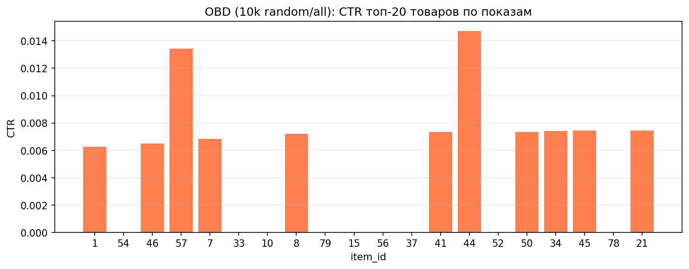
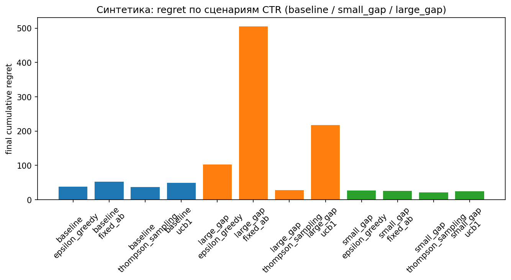
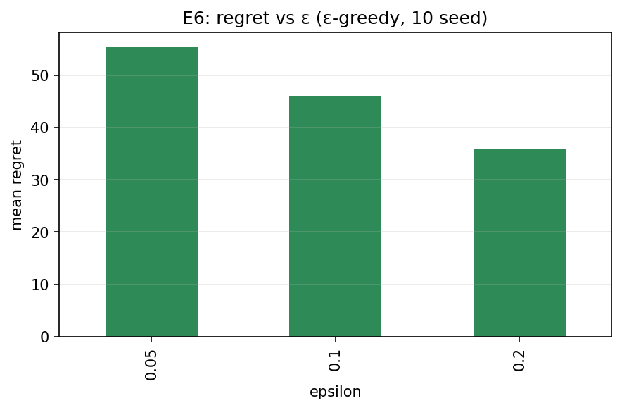
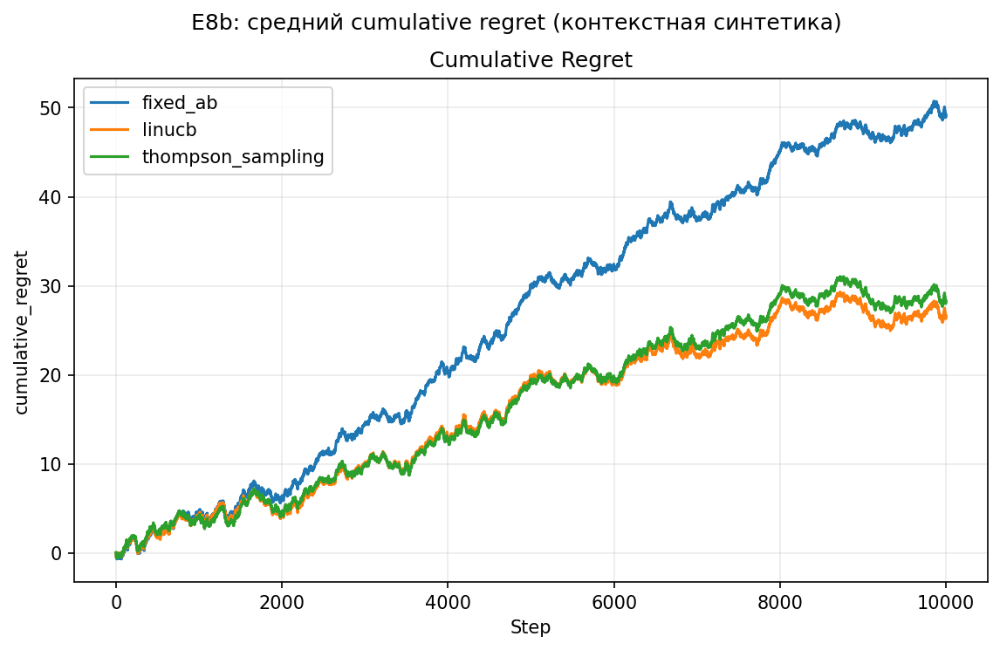
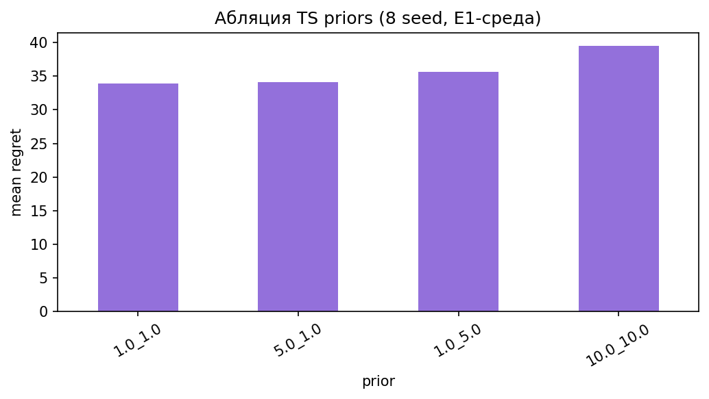
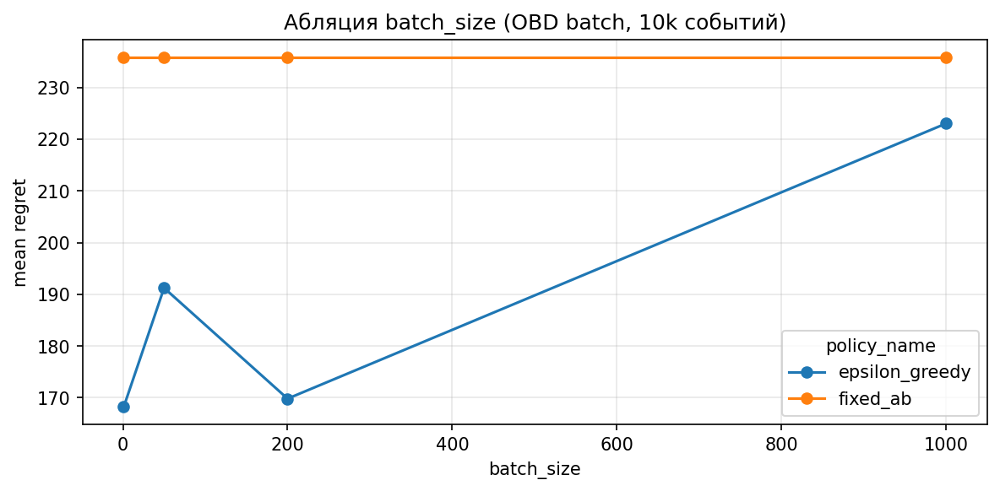
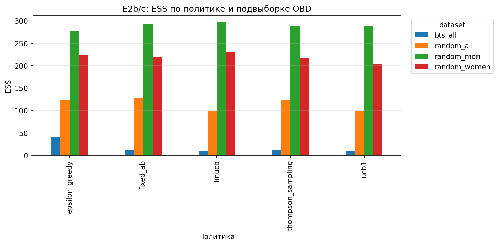
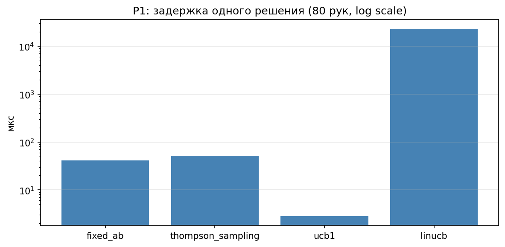

# Глава 3. Экспериментальная часть

Постановка задачи, обозначения и исследовательские вопросы — в главе 1 (§1.2, §1.6–1.8); теоретическая база — в главе 2.

---

## 3.1. Цель и постановка

Цель экспериментальной части — эмпирически исследовать **онлайн-эксперимент** в рекомендательной постановке (выбор варианта показа, метрика CTR): сначала проверить, приносит ли адаптивное назначение трафика измеримую пользу по сравнению с фиксированным split, затем — какие процедуры позволяют корректно интерпретировать логи такого эксперимента и получить статистически обоснованный вывод о rollout. Постановка согласуется с OBD [26] и типичными задачами маркетплейсов; в других доменах целевой метрикой может быть конверсия, выручка, удержание и т. д. Проверяются RQ1–RQ7 (§1.6).

В индустрии эти вопросы часто смешивают: высокий CTR во время MAB-теста подают как доказательство для выката. Глава 3 разводит их явно. **Блок I (польза онлайн-эксперимента)** отвечает: даёт ли адаптивное назначение больше кликов и меньший regret, чем `fixed_ab`? **Блок II (статистическая значимость и интерпретация логов)** отвечает: можно ли по логам того же эксперимента честно заявить «B лучше A» — и если нет, какие известные процедуры это исправляют?

В рамках выбранной метрики удобно разделить два родственных, но разных вопроса. Первый — статистический: после эксперимента можно ли обоснованно принять решение о выкате (rollout) нового варианта, если нас интересует, например, рост CTR у тестового варианта по сравнению с контрольным. Для такого вывода обычно запускают A/B-тест с фиксированным разбиением трафика, чаще всего 50/50. Второй — операционный: как не терять ценные события (в нашей постановке — клики), пока эксперимент ещё идёт, не отдавая половину показов заведомо слабому варианту. Здесь применяют бандитов, которые перенаправляют трафик к варианту с лучшим промежуточным CTR. Первый вопрос относится к статистическому выводу (inference): корректность p-value, контроль ошибки I рода. Второй — к онлайн-оптимизации: сколько кликов накоплено за горизонт. Ответ на один не подменяет ответ на другой.

**Структура главы по двум блокам:**

| Блок | Вопрос | Эксперименты | Тип оценки |
|---|---|---|---|
| **I. Польза адаптивного онлайн-эксперимента** | MAB / contextual bandit снижают regret и дают больше кликов? | E1, E6, E8b, E12; абляции | онлайн-оптимизация |
| **II. Статистическая значимость и логи** | Как корректно интерпретировать логи и получить вывод о rollout? | E4, E5, E11, E14; inference в E12 | статистический вывод |
| *Дополнение* | Как интерпретировать уже собранные логи без нового трафика? | E2, E2b/c, E9, E13 | OPE |
| *Инженерия* | Успевает ли алгоритм в production по latency? | P1 | применимость |

Блок I не доказывает статистическую значимость; блок II не измеряет regret. OPE и P1 дают контекст для полной картины онлайн-эксперимента, но центральная линия главы — связка «польза → проблема inference → известные решения».

Обозначения политик и метрик — в §1.2.

Эксперименты реализованы на Python в пакете `src/`; корректность проверяется автоматическими тестами. Политика `fixed_ab` моделирует только схему распределения трафика, а не полный цикл A/B-теста с расчётом размера выборки — последний вынесен в блок II (E4, E5, E11, E14).

---

## 3.2. Четыре типа оценки

Полное описание четырёх типов оценки (онлайн-оптимизация, статистический вывод, OPE, продуктовая применимость) — в §1.8. В главе 3 эксперименты сгруппированы по этим типам; центральная линия — блоки I и II (§3.1). Смешивать метрики optimization и inference в одном заключении методологически некорректно [5, 21].

---

## 3.3. Исходные данные

**Синтетическая среда** моделирует K вариантов с известными вероятностями клика. В E1 — пять рук с CTR от 3% до 5%; в E12 — две руки с CTR 5% и 8%. На каждом шаге политика выбирает вариант и получает бинарный отклик. Синтетика позволяет однозначно интерпретировать regret и проводить абляции (E6 по параметру ε).

**Open Bandit Dataset (OBD)** — логи fashion e-commerce ZOZOTOWN [26]. Каждая запись — показ товара: `item_id`, позиция, признаки пользователя, клик и propensity. Доступны подвыборки с равномерным random-показом и с адаптивной политикой BTS; сегменты all, men, women. В курсовой используются учебная подвыборка small OBD (10 000 событий, 38–46 кликов, CTR около 0,4%) и полный random/all (1 374 327 событий, 4 768 кликов, E9a). В кампании all — 80 товаров; это многорукая постановка, а не классический A/B двух карточек.

### 3.3.1. Разведочный анализ OBD (EDA)

Перед OPE и pairwise-проекцией (E13) выполнен разведочный анализ учебной подвыборки `random/all` (10 000 событий). По полю `item_id` агрегированы показы, клики и CTR; в кампании all зафиксировано 80 уникальных товаров. Суммарный CTR подвыборки — 0,38–0,46% (38–46 кликов на 10 000 показов): типичный для fashion e-commerce низкий CTR, при котором даже миллион событий даёт лишь тысячи кликов (E9a).

Распределение CTR по товарам сильно скошено: у большинства позиций в топ-20 по показам CTR от 0% до 1,5%; единичные клики на сотни показов — норма, а не выброс. На рис. 3.5 показаны CTR двадцати самых частых `item_id`; разброс подтверждает, что ranking алгоритмов по SNIPS на таком объёме будет шумным (E2, E9).

Для pairwise-постановки E13 из топ-20 по показам (`min_impressions = 100`) выбрана пара `item_id` 41 и 50 с минимальным |CTR_A − CTR_B| — квази-null: по 136 показов, CTR 0,735% у обоих, gap 0. Артефакты: `outputs/obd_pair/item_ctr_stats.csv`, `pair_selection.csv`.

**Рисунок 3.5 — OBD: CTR топ-20 товаров по числу показов (10k random/all)**

**Постановка «две версии карточки»** (E12, E13) моделирует продуктовый A/B: контрольный вариант A и тестовый вариант B, гипотеза CTR_B > CTR_A. E12 решает это на чистой синтетике; E13 проецирует логи OBD на две выбранные `item_id` (§3.6.4).

**Ограничения:** один домен, низкий CTR, упрощение интерфейса (одна позиция). Связка «синтетика + OBD» даёт контролируемый бенчмарк и реальные логи с propensity.

---

## 3.4. Метрики

При онлайн-оптимизации фиксируются суммарное число кликов за горизонт (в таблицах — reward или cumulative_reward), regret и suboptimal_share.

При OPE — SNIPS-оценка CTR candidate-политики, acceptance rate и ESS.

При статистическом выводе — rejection rate (доля прогонов с p-value < α), p-value, доверительный интервал, бинарное решение об отклонении H₀.

При оценке применимости — среднее время одного решения алгоритма в микросекундах.

---

## 3.5. Программная реализация

Политики — в `bandits/`; среды — в `environments/`; strict OPE — в `ope/`; процедуры A/B-вывода — в `ab_testing/` (`inference.py`, `sequential.py`, `bandit_logs.py`, `weighted_inference.py`). Ниже результаты сгруппированы по четырём типам оценки (§1.8, §3.2); внутри каждого блока эксперименты идут по кодам E1–E14, затем P1. Соответствие RQ и экспериментов — в табл. 1.2 (§1.6); сводка параметров прогонов — в табл. 3.1.

**Таблица 3.1 — Сводка экспериментов**

| Код | RQ | Тип оценки | Данные | Объём |
|:--:|:--:|:--|:--|:--|
| E1 | RQ1 | онлайн, regret | синтетика, 5 рук | T=5000, 20 seed |
| E2 | RQ2 | OPE strict | OBD random/all | 10 000 соб., 10 seed |
| E2b/c | RQ6 | OPE strict | OBD ×4 подвыборки | 10 000 соб., 20 seed |
| E4 | RQ3.1 | inference, Monte Carlo | синтетика, 2 руки | 200 trials, T=20 000 |
| E5 | RQ3.1 | inference, иллюстрация | синтетика, 2 руки | T=5000, 1 seed |
| E6 | RQ4 | онлайн, абляция ε | синтетика, 5 рук | T=5000, 10 seed ×3 ε |
| E8b | RQ5 | онлайн, контекст | синтетика | T=10 000, 20 seed |
| E9a | RQ2 | OPE streaming | OBD full random/all | 1,37 млн соб., 10 seed |
| E9b | RQ6 | OPE streaming | OBD bts/all | 1 млн соб., 10 seed |
| E11 | RQ3.2 | IPS-weighted inference | синтетика, 2 руки | 100 trials, T=20 000 |
| E14 | RQ3.3 | sequential / peeking | синтетика, 2 руки | 200 trials, T=20 000 |
| E12 | RQ7 | онлайн + inference | синтетика, 2 руки | T=10 000, 20 seed |
| E13 | RQ7 | OPE (иллюстрация) | OBD pairwise | 272 соб., приложение А |
| P1 | продукт | latency | — | 20 000 вызовов, 80 рук |
| E3, E8 | — | batch smoke (приложение) | OBD | см. приложение А |

---

## 3.6. Эксперименты и результаты

Эксперименты сгруппированы по двум центральным блокам (§3.1). **§3.6.1** и начало **§3.6.4** (онлайн-часть E12) относятся к блоку I: измеряем пользу адаптивного онлайн-эксперимента. **§3.6.2** и inference-часть **§3.6.4** — к блоку II: проверяем, как получить статистически корректный вывод и где ломаются naïve процедуры. **§3.6.3** (OPE) и **§3.6.5** (P1) дополняют картину интерпретации логов и инженерной применимости.

### 3.6.1. Блок I: польза адаптивного онлайн-эксперимента (E1, E6, E8b)

Классический A/B-тест фиксирует split на весь срок: это честно для проверки гипотезы, но расточительно для метрик — часть трафика всё время уходит на слабый вариант. Бандит максимизирует CTR во время эксперимента, смещая трафик к лучшему варианту. Ниже проверяется, насколько выигрыш заметен на контролируемой синтетике.

**Эксперимент E1 (RQ1).** Пятирукая Bernoulli-среда с CTR от 3% до 5%; оптимальный вариант — 5%. Горизонт T = 5000, 20 seed. Сравниваются `fixed_ab` (равномерно по 20% на руку), ε-greedy (ε = 0,1), UCB1 и Thompson Sampling. Для `fixed_ab` при K = 5 теоретически suboptimal_share = 1 − 1/K = 0,80: одна рука оптимальна, четыре — нет. В табл. 3.2 эмпирическое значение 0,80 совпадает с расчётом. У адаптивных политик suboptimal_share ниже (0,63–0,77), regret — меньше.

**Таблица 3.2 — E1: онлайн-оптимизация (среднее ± ст. откл. по 20 seed, T = 5000)**

Столбцы: `policy_name` — политика; `reward` — суммарное число кликов; `regret` — недобранные клики относительно оракула; `suboptimal_share` — доля показов не лучшего варианта.

| policy_name | reward | regret | suboptimal_share |
|---|---:|---:|---:|
| thompson_sampling | 213,4 | **36,6 ± 14,1** | 0,64 |
| epsilon_greedy | 211,6 | 38,4 ± 30,0 | 0,63 |
| ucb1 | 201,0 | 49,1 ± 12,2 | 0,77 |
| fixed_ab | 197,5 | 52,6 ± 12,0 | 0,80 |

Все три MAB-алгоритма опережают `fixed_ab` на 14–16 пунктов regret. Лидирует TS; ε-greedy близок, но с большим разбросом по seed. UCB1 отстаёт из-за консервативного exploration при близких CTR и коротком горизонте.

**Стабильность по seed.** Разность mean regret (`fixed_ab` − TS) = 16,0; стандартная ошибка разности при 20 независимых seed ≈ 4,1 (pooled SE); **95% ДИ** ≈ [8,0; 24,0] кликов. Bootstrap по 20 seed (10 000 resamples): 95%-перцентиль разности [7,5; 24,5] — интервал не включает 0. Это подтверждает устойчивость выигрыша TS в блоке I; для inference (блок II) применяются отдельные процедуры (§3.6.2).

**Эксперимент E6 (RQ4)** на той же среде исследует зависимость regret от ε в ε-greedy при ε ∈ {0,05; 0,10; 0,20}, по 10 seed. Regret монотонно падает с 55,4 до 36,0, suboptimal_share — с 0,83 до 0,63 (табл. 3.3). Слишком малое ε ведёт себя почти как greedy и проигрывает TS при том же горизонте.

**Таблица 3.3 — E6: абляция ε-greedy (среднее, 10 seed, T = 5000)**

| ε | reward | regret | suboptimal_share |
|---:|---:|---:|---:|
| 0,05 | 194,60 | 55,40 | 0,83 |
| 0,10 | 204,00 | 46,00 | 0,76 |
| 0,20 | 214,00 | **36,00** | 0,63 |

**Дополнение к E1 — сценарии разброса CTR.** Помимо базовой пятирукой среды E1 проверены два крайних случая на той же горизонте T = 5000 и 20 seed: **small_gap** (CTR 4,6–5,4%, шаг ~0,2 п.п.) и **large_gap** (лидер 15% CTR против 1–4% у остальных). При малом разбросе regret у всех политик сходится (21–26), бандит почти не отделяется от `fixed_ab`. При большом разрыве TS резко снижает regret (28,3 против 505,8 у `fixed_ab`): адаптивное перераспределение окупается, когда лучший вариант очевиден (табл. 3.4, рис. 3.4).

**Таблица 3.4 — Сценарии small_gap / large_gap (средний regret, T = 5000, 20 seed)**

| scenario | fixed_ab | ε-greedy | UCB1 | Thompson Sampling |
|---|---:|---:|---:|---:|
| baseline (E1) | 52,6 | 38,4 | 49,1 | **36,6** |
| small_gap | 25,9 | 26,8 | 24,5 | **21,0** |
| large_gap | 505,8 | 103,0 | 217,2 | **28,3** |

**Рисунок 3.4 — Regret по сценариям разброса CTR**

**Рисунок 3.6 — Абляция ε (E6)**

**Эксперимент E8b (RQ5)** — контекстная синтетика: пять рук, четырёхмерный контекст, CTR каждой руки — сигмоида от скалярного произведения. T = 10 000, 20 seed. Сравниваются `linucb`, `thompson_sampling` и `fixed_ab`. При информативном контексте LinUCB даёт наименьший regret (26,6 ± 30,0) против 28,3 у TS и 49,2 у `fixed_ab` (табл. 3.5). TS чаще выбирает неоптимальную руку (suboptimal_share 0,86), поскольку не использует признаки.

**Таблица 3.5 — E8b: контекстная синтетика (среднее ± ст. откл., 20 seed, T = 10 000)**

| policy_name | reward | regret | suboptimal_share |
|---|---:|---:|---:|
| linucb | 1973,4 | **26,6 ± 30,0** | 0,78 |
| thompson_sampling | 1971,7 | 28,3 ± 33,2 | 0,86 |
| fixed_ab | 1950,8 | 49,2 ± 38,2 | 0,80 |

**Стабильность LinUCB vs fixed (E8b).** Средний regret LinUCB ниже fixed на 22,6 пункта, но разброс велик (σ ≈ 30–38). Bootstrap по 20 seed: 95%-ДИ разности (fixed − LinUCB) ≈ [−5; 50] — **включает 0**; однозначно утверждать превосходство LinUCB над fixed по regret нельзя, хотя точечная оценка благоприятна. Сравнение LinUCB с TS (26,6 vs 28,3) тем более не различимо на этом объёме seed. Вывод E8b — **иллюстрация потенциала** контекстного бандита при информативных признаках, а не жёсткий ranking.

**Рисунок 3.1 — E8b: средний cumulative regret (контекстная синтетика, 20 seed, T = 10 000)**

В совокупности E1, E6 и E8b показывают: **адаптивный онлайн-эксперимент** с MAB накапливает больше кликов, чем фиксированное A/B-разбиение; выигрыш усиливается при большом разрыве CTR (табл. 3.4). В E8b наблюдается **тенденция** в пользу LinUCB при информативном контексте, но bootstrap не подтверждает значимого отрыва от fixed и TS (см. абзац выше). Это ответ на вопрос блока I — «приносит ли пользу» — и **не** ответ на вопрос статистической значимости для rollout; последний проверяется в §3.6.2.

**Дополнительные абляции (notebook 03).** На той же синтетике E1 проверена чувствительность Thompson Sampling к priors `(α, β) ∈ {(1,1), (1,5), (5,1), (10,10)}` — разброс mean regret небольшой (рис. 3.7). На OBD в batch-режиме (10k событий) сравнивались `batch_size ∈ {1, 50, 200, 1000}`: при укрупнении пакета regret `fixed_ab` и ε-greedy сходятся, что иллюстрирует компромисс между частотой обновления и шумом оценки (рис. 3.8).

**Рисунок 3.7 — Абляция priors Thompson Sampling**

**Рисунок 3.8 — Абляция batch_size (OBD batch)**

### 3.6.2. Блок II: статистическая значимость и интерпретация логов (E4, E5, E11, E14)

Блок I показал измеримую пользу адаптивного назначения. Блок II отвечает на продуктовый вопрос, который обычно следует за ним: **можно ли по логам того же эксперимента заявить статистически значимый эффект** и принять решение о rollout? Литература (§2.2.2) предупреждает: naïve A/B-процедуры здесь часто некорректны. Ниже проверяются три типичных нарушения и известные обходные пути.

Больше кликов во время эксперимента не равно статистически доказанному превосходству B над A. Для rollout нужен отдельный статистический вывод, и к логам бандита его нельзя применять наивно.

Продуктовая гипотеза: CTR варианта B выше, чем у A. В экспериментах E4, E11 и E14 используются два сценария. В сценарии **null** CTR_A = CTR_B — варианты одинаковы, гипотеза «B лучше» ложна; хороший тест не должен отвергать H₀. В сценарии **effect** CTR_B > CTR_A — эффект есть; хороший тест должен отвергать H₀ с высокой вероятностью (мощность). Rejection rate при null — доля прогонов, где тест ошибочно заявил «эффект есть»; при уровне значимости α = 5% она должна быть около 5%.

Обычный z-критерий A/B предполагает фиксированный split до начала эксперимента и условную независимость наблюдений. Бандит нарушает оба условия: перекладывает трафик по промежуточным результатам. Отдельная проблема возникает при **непрерывном мониторинге** fixed A/B: если смотреть p-value на промежуточных долях горизонта и останавливать эксперимент при первом «значимом» результате, naïve критерий завышает ошибку I рода даже при честном 50/50 split [19]. Для этого случая в литературе предлагают group sequential design с границами O'Brien–Fleming [19]; адаптивное назначение трафика бандитом — другая проблема, и одна процедура не заменяет другую.

**Эксперимент E4 (RQ3.1).** Monte Carlo: 200 прогонов, T = 20 000, α = 0,05. Логи генерируются `fixed_ab` или Thompson Sampling; к обоим применяется один naïve z-критерий. Горизонт 20 000 выбран для осмысленной мощности при effect +1 п.п. CTR (5% vs 6%).

**Таблица 3.6 — E4: naïve A/B на фиксированном и адаптивном назначении (T = 20 000)**

Столбцы: `scenario` — null (нет эффекта) или effect; `policy` — политика генерации логов; `CTR_A`, `CTR_B` — истинные CTR контрольного и тестового вариантов; `rejection_rate` — доля прогонов с отклонением H₀; `target` — целевое значение (0,05 при null, 0,80 при effect).

| scenario | policy | CTR_A | CTR_B | rejection_rate | target |
|---|---|---:|---:|---:|---:|
| null | fixed_ab | 0,05 | 0,05 | **0,030** | 0,05 |
| null | thompson_sampling | 0,05 | 0,05 | **0,145** | 0,05 |
| effect | fixed_ab | 0,05 | 0,06 | **0,850** | 0,80 |
| effect | thompson_sampling | 0,05 | 0,06 | 0,550 | 0,80 |

**Таблица 3.7 — E4: мощность при росте эффекта (fixed_ab, T = 20 000, 200 trials)**

| CTR_B | ΔCTR | rejection_rate fixed_ab | rejection_rate TS (naïve) |
|---:|---:|---:|---:|
| 0,06 | +1 п.п. | 0,850 | 0,550 |
| 0,08 | +3 п.п. | **1,000** | 0,975 |

При слабом +1 п.п. `fixed_ab` даёт мощность 85%; при заметном +3 п.п. — 100%. На логах TS naïve inference догоняет только при крупном эффекте, что согласуется с перекосом групп (E5).

При null `fixed_ab` даёт rejection rate 3,0% — ниже номинальных 5% из-за конечного Monte Carlo (200 trials), дискретности Bernoulli и **одностороннего** теста CTR_B > CTR_A; при большем числе trials оценка сходится к α. У TS с naïve тестом — 14,5% (E4) и 10% (E11, 100 trials). При effect мощность `fixed_ab` — 85%, у TS — 55%. Перекос групп иллюстрирует E5 (TS: 443 vs 4557 показов).

**Эксперимент E5** показывает один конкретный лог (T = 5000, seed = 42, CTR 4% vs 6%), из чего складывается завышение в E4. Это иллюстрация механизма, а не отдельный статистический вывод.

**Таблица 3.8 — E5: один прогон, перекос групп (T = 5000, seed = 42)**

Столбцы: `n_A`, `n_B` — число показов в контрольной и тестовой группах; `p_value` — naïve z-критерий; последний столбец — словесный вывод теста.

| policy | n_A | n_B | p_value | вывод |
|---|---:|---:|---:|:---|
| fixed_ab | 2443 | 2557 | 0,0018 | эффект |
| thompson_sampling | 443 | 4557 | 0,0235 | эффект |
| epsilon_greedy | 4699 | 301 | 0,4595 | нет эффекта |
| ucb1 | 2221 | 2779 | 0,1607 | нет эффекта |

У TS 90% трафика ушло в тестовую группу — z-критерий «видит» разницу, но это не классический A/B. У ε-greedy перекос в другую сторону — тест не видит реальный эффект.

Бандит и проверка гипотезы — разные эксперименты. Для rollout запускают отдельный A/B с `fixed_ab` (E4: при T = 20 000 Type I около 3%, мощность около 85%). Если эксперимент уже шёл бандитом и новый A/B невозможен — применяют IPS-weighted inference (E11).

**Эксперимент E11 (RQ3.2).** Ситуация: логи собраны под Thompson Sampling, нужен вывод «B vs A» post-hoc. Monte Carlo: 100 trials, T = 20 000, α = 0,05. Сценарий null (5% / 5%); сценарии effect — лестница +1, +3, +5 п.п. CTR. К логам TS с propensity применяется IPS-weighted оценка; для сравнения — naïve z-критерий на TS-логах и naïve z-критерий на чистом `fixed_ab` (эталон).

**Таблица 3.9 — E11: Type I и слабый эффект (+1 п.п., T = 20 000)**

Столбцы: `method` — процедура вывода; `rejection_rate` — доля отклонений H₀; `target` — целевое значение.

| scenario | method | rejection_rate | target |
|---|---|---:|---:|
| null | naive_ab_full_ts | 0,100 | 0,05 |
| null | naive_ab_fixed_only | 0,030 | 0,05 |
| null | ips_weighted_ab | 0,050 | 0,05 |
| effect (+1 п.п.) | naive_ab_full_ts | 0,510 | 0,80 |
| effect (+1 п.п.) | naive_ab_fixed_only | 0,850 | 0,80 |
| effect (+1 п.п.) | ips_weighted_ab | 0,240 | 0,80 |

**Таблица 3.10 — E11: мощность IPS при росте эффекта (`ips_weighted_ab`, T = 20 000)**

| ΔCTR | CTR_A → CTR_B | rejection_rate IPS | rejection_rate fixed_ab |
|---:|---|---:|---:|
| +1 п.п. | 5% → 6% | 0,240 | 0,850 |
| +3 п.п. | 5% → 8% | 0,780 | 1,000 |
| +5 п.п. | 5% → 10% | 0,970 | 1,000 |

IPS восстанавливает контроль Type I на адаптивных логах (5% против 10% у naïve). На слабом +1 п.п. мощность IPS низкая (24%): адаптивный лог даёт мало информации о редко показываемой руке (низкий ESS). При +3 п.п. IPS находит эффект в 78% прогонов, при +5 п.п. — в 97%. Для rollout слабой гипотезы нужен отдельный A/B; IPS — post-hoc инструмент при заметном эффекте.

**Эксперимент E14 (RQ3.3)** отделяет **peeking** при fixed split от **adaptive allocation** бандита. Пять процедур: `fixed_horizon`, `naive_peek` (4 looks), group sequential **OBF** [33], always-valid **mSPRT** [19] (τ = 0,02). Monte Carlo: 200 trials, T = 20 000, α = 0,05.

**Таблица 3.11 — E14: peeking и sequential inference (T = 20 000, 200 trials)**

Столбцы: `method` — процедура вывода; `rejection_rate` — доля отклонений H₀; `mean_stop_fraction` — средняя доля горизонта, на которой эксперимент остановлен. OBF — 4 looks (25/50/75/100%); mSPRT — непрерывный мониторинг (τ = 0,02, burn-in 100 пар).

| scenario | policy | method | rejection_rate | mean_stop_fraction | target |
|---|---|---|---:|---:|---:|
| null | fixed_ab | fixed_horizon | 0,030 | 1,00 | 0,05 |
| null | fixed_ab | naive_peek | **0,110** | 0,95 | 0,05 |
| null | fixed_ab | group_sequential_obf | **0,040** | 1,00 | 0,05 |
| null | fixed_ab | always_valid_msprt | **0,020** | 0,98 | 0,05 |
| null | thompson_sampling | fixed_horizon | 0,145 | 1,00 | 0,05 |
| null | thompson_sampling | naive_peek | **0,210** | 0,89 | 0,05 |
| null | thompson_sampling | group_sequential_obf | **0,145** | 0,99 | 0,05 |
| null | thompson_sampling | always_valid_msprt | 0,005 | 1,00 | 0,05 |
| effect | fixed_ab | fixed_horizon | 0,850 | 1,00 | 0,80 |
| effect | fixed_ab | naive_peek | 0,900 | 0,61 | 0,80 |
| effect | fixed_ab | group_sequential_obf | 0,855 | 0,80 | 0,80 |
| effect | fixed_ab | always_valid_msprt | 0,585 | 0,74 | 0,80 |
| effect | thompson_sampling | fixed_horizon | 0,550 | 1,00 | 0,80 |
| effect | thompson_sampling | naive_peek | 0,660 | 0,69 | 0,80 |
| effect | thompson_sampling | group_sequential_obf | 0,560 | 0,93 | 0,80 |
| effect | thompson_sampling | always_valid_msprt | 0,010 | 1,00 | 0,80 |

На логах `fixed_ab` naïve peeking при null поднимает rejection rate с 3% до 11%: многократные «подглядывания» без поправки раздувают число ложных срабатываний. Оба корректных sequential-подхода восстанавливают контроль: OBF — 4%, mSPRT — 2%. При effect OBF сохраняет мощность, близкую к fixed horizon (85,5% против 85%); mSPRT останавливает эксперимент раньше (mean_stop_fraction ≈ 0,74), но при слабом +1 п.п. детектирует эффект только в 58,5% прогонов — ниже целевых 80%. Это согласуется с Johari et al. [19]: для Bernoulli при умеренном α формула mSPRT приближённая, а мощность зависит от заранее выбранного τ; OBF с четырьмя looks проще в реализации и в данной постановке мощнее.

На логах Thompson Sampling ни OBF, ни mSPRT **не заменяют** IPS и **не чинят** adaptive allocation. OBF при null даёт те же 14,5%, что naïve тест в конце горизонта: split не фиксирован, и group sequential не рассчитан на data-dependent назначение. mSPRT ведёт себя иначе — rejection rate при null падает до 0,5%, мощность при effect — до 1% — не потому что вывод стал корректным, а потому что при перекосе групп эффективное число пар мало и тест теряет чувствительность. Johari et al. [19] оговаривают, что always-valid inference распространяется на fixed allocation; bandit-логи — отдельная задача (E4 → отдельный A/B; E11 → IPS).

**Итог блока II.** Три независимые проблемы интерпретации логов онлайн-эксперимента покрыты эмпирически: (1) **adaptive allocation** — E4, E5 → отдельный fixed A/B или IPS (E11); (2) **post-hoc на bandit-логах** — E11; (3) **peeking на fixed split** — E14 → OBF / mSPRT. Ни одна sequential-процедура не заменяет IPS на логах бандита; cumulative CTR из блока I не заменяет p-value из блока II.

### 3.6.3. Интерпретация логов OBD: офлайн-оценка (E2, E2b/c, E9)

Блоки I и II разделены на синтетике. В production логи уже собраны под конкретной logging policy; сравнение кандидатов без нового выката — через OPE [24], [26]. Блок не заменяет блок II, но показывает слабую зону интерпретации: ranking по SNIPS при низком CTR и adaptive-логах.

**Эксперимент E2 (RQ2)** — strict OPE на `random/all`: 10 000 событий, 80 рук, random logging. Четыре candidate-политики, SNIPS, 10 seed. `fixed_ab` при random logging лидирует по SNIPS (0,0023, ESS 130,8); остальные близки к нулю (табл. 3.12). 38 кликов на 10 000 показов недостаточно для уверенного ranking; OPE демонстрирует пайплайн, но не выбирает «лучший бандит для production».

**Таблица 3.12 — E2: strict OPE (среднее, 10 seed)**

Столбцы: `acceptance_rate` — доля совпадений candidate с логом; `snips_estimate` — оценка CTR; `ESS` — эффективный размер выборки.

| policy_name | acceptance_rate | snips_estimate | ESS |
|---|---:|---:|---:|
| fixed_ab | 0,0131 | **0,0023** | 130,8 |
| thompson_sampling | 0,0122 | 0,0017 | 122,1 |
| epsilon_greedy | 0,0125 | 0,0000 | 124,6 |
| ucb1 | 0,0099 | 0,0000 | 99,0 |

**Эксперимент E2b/c (RQ6)** расширяет E2 на четыре подвыборки: `random/all`, `bts/all`, `random/men`, `random/women`, 20 seed. Лидер по SNIPS меняется (`fixed_ab` на all, ε-greedy на men, LinUCB на women). На `bts/all` ESS падает до 12 против 129 на `random/all` — весовая оценка деградирует при adaptive logging (табл. 3.13, рис. 3.2).

**Рисунок 3.2 — E2b/c: ESS по политике и подвыборке OBD**

**Таблица 3.13 — E2b/c: лучшая политика по SNIPS**

| dataset | лучший SNIPS | policy_name | ESS |
|---|---:|---|---:|
| random_all | 0,00283 | fixed_ab | 129 |
| bts_all | 0,00640 | fixed_ab | **12** |
| random_men | 0,01334 | epsilon_greedy | 277 |
| random_women | 0,01724 | linucb | 232 |

Разведочные batch-прогоны E3 и E8 на OBD (не strict OPE, без counterfactual для LinUCB) вынесены в **приложение А** — в основной текст не включены.

**Эксперимент E9** масштабирует OPE: E9a — полный `random/all` (1 374 327 событий, 4 768 кликов); E9b — первый миллион `bts/all`, 10 seed, потоковая обработка. ESS вырос примерно в 134 раза (129 → 17 243), но лидер по SNIPS сменился с `fixed_ab` (E2) на ε-greedy (E9a); разрыв между политиками порядка 0,001 при высокой дисперсии. На BTS ESS для TS — 189, для UCB1 — около нуля (табл. 3.14–3.15).

**Таблица 3.14 — E9a: full random/all (среднее ± ст. откл., 10 seed)**

| policy_name | snips_estimate | ESS | acceptance_rate |
|---|---:|---:|---:|
| epsilon_greedy | **0,00421 ± 0,00148** | 15 282 | 1,11% |
| thompson_sampling | 0,00374 ± 0,00027 | 17 132 | 1,25% |
| fixed_ab | 0,00341 ± 0,00047 | 17 243 | 1,25% |
| ucb1 | 0,00326 ± 0,00000 | 3 072 | 0,22% |

**Таблица 3.15 — E9b: bts/all (среднее ± ст. откл., 10 seed)**

| policy_name | snips_estimate | ESS | acceptance_rate |
|---|---:|---:|---:|
| epsilon_greedy | **0,00427 ± 0,00140** | 5 014 | 5,81% |
| fixed_ab | 0,00281 ± 0,00113 | 659 | 1,25% |
| thompson_sampling | 0,00121 ± 0,00068 | 189 | 0,16% |
| ucb1 | 0,00000 | 21 | 0,007% |

**Таблица 3.16 — сравнение масштаба OPE (`fixed_ab`)**

| Этап | событий | кликов | ESS | лидер SNIPS |
|---|---:|---:|---:|---|
| E2, random/all | 10k | 38 | 129 | fixed_ab |
| E9a, random/all | 1,37M | 4 768 | 17 243 | epsilon_greedy |
| E2b/c, bts/all | 10k | 42 | 12 | fixed_ab |
| E9b, bts/all | 1M | 3 500 | 659 | epsilon_greedy |

Цепочка E2 → E2b/c → E9 показывает: OPE-пайплайн работает; ranking на малых выборках хрупок; масштаб улучшает ESS, но не даёт уверенного ранжирования на low-CTR логах с 80 руками; logging policy критична.

### 3.6.4. Постановка «две версии карточки» (E12, E13, RQ7)

На маркетплейсе часто формулируют: «две версии карточки A и B». **E12** на синтетике проверяет блок I (клики) и блок II (inference). **E13** — иллюстрация проекции 80-ручного OBD на две `item_id` (272 события, ~1 клик на руку); это **не** классический A/B и не источник rollout-выводов. Протокол выбора пары — приложение А; сравнение постановок — табл. 3.19.

**Эксперимент E12.** CTR_A = 5%, CTR_B = 8%. T = 10 000, 20 seed. `fixed_ab` 50/50, TS, ε-greedy (ε = 0,1).

**Таблица 3.17 — E12: онлайн-оптимизация (среднее, 20 seed, T = 10 000)**

Столбцы: `cumulative_reward` — суммарные клики; `cumulative_regret` — недобранные клики; `suboptimal_share` — доля показов не лучшего варианта.

| policy_name | cumulative_reward | cumulative_regret | suboptimal_share |
|---|---:|---:|---:|
| thompson_sampling | **786,9** | **13,1** | **0,048** |
| epsilon_greedy | 772,5 | 27,5 | 0,088 |
| fixed_ab | 648,4 | 151,7 | 0,501 |

TS набирает 786,9 кликов при regret 13,1; `fixed_ab` — 648,4 кликов, regret 151,7. Разрыв около 140 кликов на 10 000 показов. Картина совпадает с E1: бандит выигрывает по кликам в pairwise-сценарии.

Второй блок E12 — inference на тех же CTR: 100 Monte Carlo trials, α = 0,05. Симулируются логи TS с propensity и эталон `fixed_ab`; применяются naïve z-критерий на TS, IPS-weighted inference и naïve z-критерий на fixed-логах.

**Таблица 3.18 — E12: inference при эффекте +3 п.п. (T = 10 000, 100 trials)**

Столбцы: `method` — процедура вывода; `rejection_rate` — доля прогонов с отклонением H₀; последний столбец — краткое описание метода.

| method | rejection_rate | смысл |
|---|---:|---|
| naive_ab_fixed_only | 1,00 | эталон: чистый A/B |
| ips_weighted_ab | 0,56 | IPS на логах бандита |
| naive_ab_full_ts | 0,90 | naïve на TS-логе |

Эталонный A/B находит эффект в 100% прогонов. IPS — в 56%. Naïve на TS-логе — в 90%. Для rollout нужен отдельный A/B-дизайн.

**E13 (кратко).** Проекция OBD на пару items 41/50: в 2-ручной постановке acceptance ≈ 50% (против 1,3% в 80-ручной), ESS того же порядка при 37× меньшем числе событий — иллюстрация интерпретируемости метрик, без ranking-выводов.

**Таблица 3.19 — многорукий OBD и pairwise-проекция: разные вопросы**

| | Multi-arm OBD (E2, E9) | Pairwise (E13) |
|---|---|---|
| Вопрос | Какой алгоритм лучше на 80 товарах? | Метрики на двух вариантах карточки? |
| Руки | 80 | 2 |
| События | 10k – 1,37M | 272 |
| ESS (`fixed_ab`) | 130 – 17 243 | 137 |
| Связь с A/B | слабая | проекция, не дизайн |

E12 подтверждает перенос блоков I и II на pairwise-синтетику. E13 — только методологический мост к продуктовой постановке.

### 3.6.5. Вычислительная применимость (P1)

**Эксперимент P1** измеряет wall-clock время одного решения (`select_arm` + `update`) при 80 руках, context_dim = 7, 20 000 вызовов. LinUCB требует около 23 ms на decision, TS — около 0,05 ms (табл. 3.20). LinUCB не запускался в E9 из-за стоимости. Выбор контекстного бандита — вопрос не только regret, но и инженерного бюджета.

**Таблица 3.20 — P1: задержка (мкс на decision, 80 рук, 20 000 вызовов)**

Столбец `total_decision_us` — среднее wall-clock время одного вызова `select_arm` + `update` в микросекундах.

| policy_name | total_decision_us |
|---|---:|
| ucb1 | 2,8 |
| fixed_ab | 41,6 |
| thompson_sampling | 51,2 |
| linucb | 23 080 |

**Рисунок 3.3 — P1: задержка одного решения при 80 руках (log scale)**

---

## 3.7. Краткие выводы по главе 3

Блок I: MAB снижает regret и увеличивает клики (E1, E12); блок II: naïve inference на bandit-логах некорректен (E4, E11); peeking требует sequential (E14); OPE на OBD — пайплайн без уверенного ranking (E2, E9). **Итоговая product recommendation, вклад, ограничения и возможное развитие работы** — в главе 4 (§4.1–4.4).

---

## 3.8. Аудит утечек данных и чувствительность

**Propensity и OPE.** В strict OPE propensity берётся из поля лога (`propensity_score` OBD), а не из candidate-политики — утечки «будущей» информации в веса IPS нет [26]. Candidate используется только для сравнения действия с логом (acceptance rate).

**Синтетика.** Шаги среды независимы по seed; CTR фиксированы и не подглядываются при выборе руки. Regret считается относительно оракула с известными CTR — отдельно от inference-прогонов E4/E11.

**Inference.** E4/E11/E14 генерируют свежие логи под заявленную политику; p-value не использует одни и те же данные для назначения и теста вне заявленной модели. IPS-weighted inference использует propensity логирующей политики на том же потоке — корректная post-hoc постановка [30].

**Batch-режим (E3, E8).** Помечен как невалидный для inference и strict OPE (приложение А); в основные выводы не входит.

**Чувствительность гиперпараметров.** Абляции ε (E6, рис. 3.6), priors TS и `batch_size` на OBD (рис. 3.7–3.8) показывают умеренную чувствительность regret к ε и priors; вывод блока I по лидерству TS устойчив при ε ∈ [0,1; 0,2].

**Non-stationarity.** Дрейф CTR во времени не моделировался — типичный риск в RecSys [16, 38]; возможное развитие — §4.3, направление 3.

---

## 3.9. Ограничения

Работа ограничена одним доменом (fashion e-commerce, OBD [26]) и одной бизнес-метрикой (CTR). Выводы о применимости MAB и A/B в других продуктах (конверсия, выручка, удержание) требуют отдельной проверки.

**Данные и масштаб.** Учебная подвыборка OBD (10k событий, ~40 кликов) не обеспечивает мощности для ranking 80 алгоритмов; даже полный random/all (1,37M событий, ~4,8k кликов) не стабилизировал лидера по SNIPS. Pairwise-проекция E13 (272 события) интерпретируема, но не заменяет отдельный A/B.

**Методология OPE.** Использован SNIPS, не DR [27]; batch E3/E8 — приложение А. LinUCB не оценивался в strict OPE на full OBD (P1).

**Статистический вывод.** mSPRT приближённый [19]. IPS Type I ≈ 5% (E11, 100 trials); naïve TS ≈ 10–14,5% (E11/E4). CUPED [7] не реализован — см. §4.3. Все inference — Monte Carlo на синтетике.

**Non-stationarity и GMV.** Дрейф CTR и метрика GMV не измерялись; в работе — только клики и условная иллюстрация стоимости в §4.2.

**Реализация.** Latency — in-process Python без сети. E8b не гарантирует перенос на реальные признаки.

**Обобщение.** Бандит — для онлайн-оптимизации (блок I); fixed A/B, IPS или sequential — для rollout (блок II). Возможный продуктовый пилот — §4.3–4.4.
